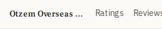
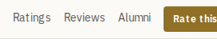
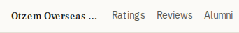
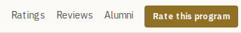
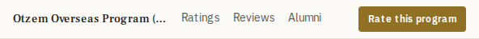
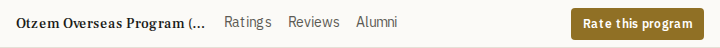

# ProgramJumpNav mobile program-name removal -- before/after

Generated 2026-08-16 against `/programs/otzem-overseas-program` (the only program found
with all three jump-nav sections qualifying: Ratings, Reviews, Alumni), via
`scripts/verify-jump-nav-mobile.ts`.

Change: `components/ProgramJumpNav.tsx`'s `<a href="#top">` program-name element
(returns the reader to the top of the page) now renders only at Tailwind's `sm`
breakpoint (640px) and up -- `hidden max-w-[12rem] shrink-0 truncate font-serif
text-sm font-medium text-foreground sm:block`, replacing the old unconditional
`max-w-[8rem] shrink-0 truncate font-serif text-sm font-medium text-foreground
sm:max-w-[12rem]`. Nothing else in the bar changed.

## Element inventory

| Width | Element | Before | After |
|---|---|---|---|
| 320 / 390 (mobile) | Program name (`#top`) | renders | **removed** |
| 320 / 390 (mobile) | Ratings / Reviews / Alumni anchors | render | unchanged |
| 320 / 390 (mobile) | "Rate this program" CTA | renders | unchanged |
| 640 / 768 (desktop) | Program name (`#top`) | renders | unchanged (still renders) |
| 640 / 768 (desktop) | Ratings / Reviews / Alumni anchors | render | unchanged |
| 640 / 768 (desktop) | "Rate this program" CTA | renders | unchanged |

The nav (`<nav aria-label="On this page">`) itself, its sticky positioning, the
scrollspy active-state logic, and the `/programs/[slug]/page.tsx` render gate (>=2
qualifying jump items) are all unchanged at every width.

## Screenshots (bar only, cropped to `nav[aria-label="On this page"]`)

At mobile widths the row is `overflow-x-auto` -- these screenshots capture the row's
own bounding box, so what's visible without scrolling is a real signal of how crowded
the row was.

### 320px

| Before | After |
|---|---|
|  |  |

Before: the truncated name alone ate enough width that only "Ratings" and part of
"Reviews" fit in view -- "Alumni" and the CTA were scrolled off-screen. After:
Ratings/Reviews/Alumni and most of the CTA fit without scrolling.

### 390px

| Before | After |
|---|---|
|  |  |

Before: name + all three anchors fit, but the CTA was pushed out of view. After: all
three anchors and the full CTA fit.

### 640px (desktop -- unchanged)

| Before | After |
|---|---|
|  |  |

### 768px (desktop -- unchanged)

| Before | After |
|---|---|
|  |  |

## Verification

`scripts/verify-jump-nav-mobile.ts` asserts, per width: the nav renders and is
visible; below `sm` the `#top` link is not visible while every jump anchor and the
Rate CTA are; at/above `sm` the `#top` link is visible and non-empty; and no
horizontal page overflow. Run against the unmodified component ("before"), it fails
exactly the two expected mobile assertions (`name-visible-on-mobile` at 320 and 390)
and passes everything else. Run against the modified component ("after"), it passes
all four widths with zero problems.

```
$ npx tsx scripts/verify-jump-nav-mobile.ts --label after
...
PASS: 0 problem(s) found.
```

`components/ProgramJumpNav.render.test.tsx` covers the same contract at the markup
level (no browser/DB needed): the `#top` link carries `hidden sm:block`, every jump
anchor and the Rate CTA carry neither, and the nav's `aria-label` is unchanged.
